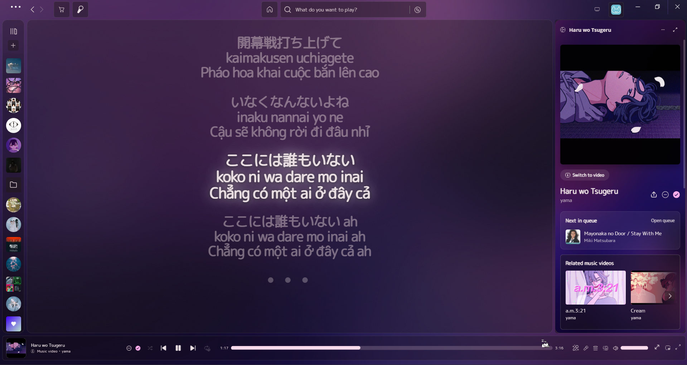
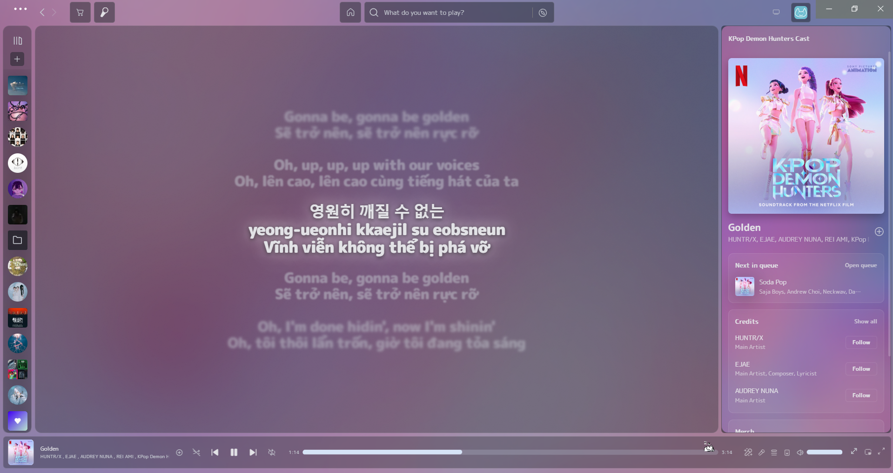
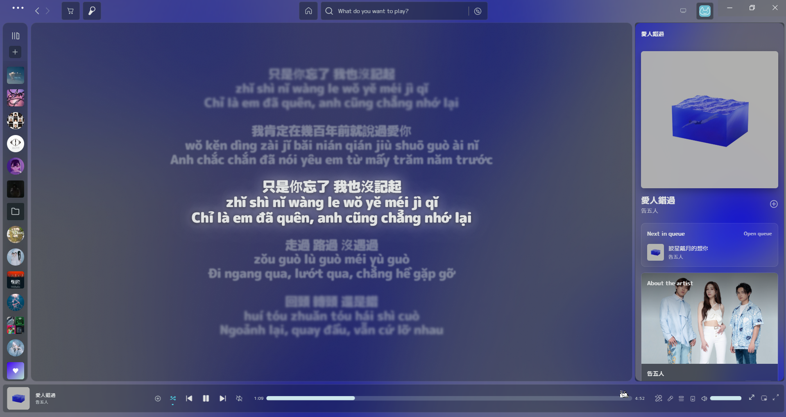
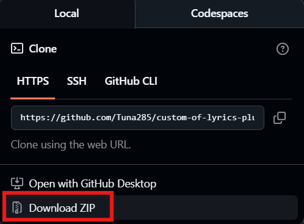

# Lyric Plus Translate

[](README.md)

> Phiên bản tùy chỉnh của **Lyrics Plus** dành cho Spicetify, tập trung vào dịch lời bài hát chất lượng cao, tối ưu cho người dùng Việt Nam. Hỗ trợ API cá nhân (Google) và thông qua [ProxyPal](https://github.com/heyhuynhgiabuu/proxypal).

> [!NOTE] > **Hiện tại, tính năng dịch chỉ hỗ trợ tiếng Việt.** Hỗ trợ cho các ngôn ngữ khác có thể được thêm vào trong các bản cập nhật tương lai.


---

## Tính năng chính

### 1. Dịch lời bài hát với Gemini API

Sử dụng các mô hình LLM của Google (qua API và Proxy) để dịch lời bài hát một cách tự nhiên và chính xác.

- **Hai chế độ hiển thị**: Chuyển đổi các bài hát sang Romaji (tiếng Nhật), Romaja (tiếng Hàn), Pinyin (tiếng Trung) và dịch sang **tiếng Việt** - lý tưởng cho việc học ngoại ngữ.
- **Chất lượng cao**: Các bản dịch được tối ưu hóa cho ngữ cảnh âm nhạc, giữ nguyên ý nghĩa và cảm xúc.

<table>
  <tr>
    <th>Tiếng Nhật → Romaji</th>
    <th>Tiếng Hàn → Romaja</th>
    <th>Tiếng Trung → Pinyin</th>
  </tr>
  <tr>
    <td></td>
    <td></td>
    <td></td>
  </tr>
</table>

### 2. Giao diện hiện đại & Trải nghiệm tối ưu

- **Nền trong suốt**: Lời bài hát hiển thị trên lớp phủ trong suốt, hài hòa với các theme của Spicetify.
- **Tự động ẩn điều khiển**: Các nút cài đặt chỉ xuất hiện khi di chuột vào, tối đa hóa không gian hiển thị.
- **Chuyển cảnh mượt mà**: Hoạt ảnh tối ưu cho việc chuyển đổi dòng lời liền mạch.

### 3. Tối ưu hóa dịch thông minh

Các prompt được tinh chỉnh và xử lý tự động để cho ra kết quả sạch sẽ, hợp lý.

---

## Cài đặt

> **Yêu cầu:** [Spotify](https://download.scdn.co/SpotifySetup.exe) được cài đặt từ web, KHÔNG phải từ Microsoft Store.

Cài đặt Spicetify:

```powershell
iwr -useb https://raw.githubusercontent.com/spicetify/cli/main/install.ps1 | iex
```

### - Cài đặt nhanh (Khuyên dùng)

Mở **PowerShell** và chạy lệnh:

```powershell
iwr -useb https://raw.githubusercontent.com/Tuna285/custom-of-lyrics-plus/main/install.ps1 | iex
```

### Gỡ cài đặt

```powershell
iwr -useb https://raw.githubusercontent.com/Tuna285/custom-of-lyrics-plus/main/uninstall.ps1 | iex
```

### - Cài đặt thủ công

1. Tải xuống và giải nén file .zip này

   

2. Sao chép thư mục `lyrics-plus` vào thư mục CustomApps của Spicetify:

   - **Windows:** `%LocalAppData%\spicetify\CustomApps`
   - **MacOS/Linux:** `~/.config/spicetify/CustomApps`

3. Mở terminal:
   ```bash
   spicetify config custom_apps lyrics-plus
   spicetify apply
   ```

---

## Cấu hình

1. Mở Spotify, nhấp vào avatar của bạn → **Lyric Plus Translate config**
2. Tới phần **Translation** và setting cấu hình chế độ API của bạn:

   - **Direct API**: Sử dụng key API [Google AI Studio](https://aistudio.google.com/)
   - **Proxy**: Sử dụng [ProxyPal](https://github.com/heyhuynhgiabuu/proxypal)

3. Di chuột qua lời bài hát và nhấp vào biểu tượng Chuyển đổi (Translation) (⇄) để tùy chỉnh chế độ hiển thị

---

## Ngôn ngữ hỗ trợ

### Chế độ Local (Kuromoji, Aromanize, OpenCC)

| Ngôn ngữ nguồn      | Display Mod 1              | Display Mod 2 |
| ------------------- | -------------------------- | ------------- |
| Tiếng Nhật (日本語) | Romaji, Hiragana, Katakana | -             |
| Tiếng Hàn (한국어)  | Romaja                     | -             |
| Tiếng Trung (中文)  | Pinyin, Giản thể, Phồn thể | -             |

### Chế độ Gemini/Gemma (Dịch AI)

| Ngôn ngữ nguồn      | Display Mod 1                        | Display Mod 2 |
| ------------------- | ------------------------------------ | ------------- |
| Tiếng Nhật (日本語) | Romaji (Gemini/Gemma), bao gồm Local | Tiếng Việt    |
| Tiếng Hàn (한국어)  | Romaja (Gemini/Gemma), bao gồm Local | Tiếng Việt    |
| Tiếng Trung (中文)  | Pinyin (Gemini/Gemma), bao gồm Local | Tiếng Việt    |
| Khác                | -                                    | Tiếng Việt    |

---

## Credits

- Bản gốc [lyrics-plus](https://github.com/spicetify/cli/tree/main/CustomApps/lyrics-plus) bởi nhóm Spicetify
- Dịch thuật được hỗ trợ bởi Google Gemini API
- Phiên âm: [Kuroshiro](https://github.com/hexenq/kuroshiro), [Aromanize](https://github.com/fujaru/aromanize-js), [OpenCC](https://github.com/BYVoid/OpenCC)

---

## Đề xuất

- Theme: [**Spicetify Lucid**](https://github.com/sanoojes/spicetify-lucid) của sanoojes.
- TV Mode và Fullscreen Mode: [**Tạo bởi Spicetify Creator**](https://github.com/daksh2k/Spicetify-stuff/tree/master/Extensions/full-screen).
  _(Cả hai có thể tải ở Spicetify Marketplace)_

---

## Giấy phép

[LGPL-2.1](LICENSE)

---

_Dự án này đang được phát triển. Vui lòng báo cáo bất kỳ lỗi cũng như đề xuất tính năng và vấn đề nào!_
